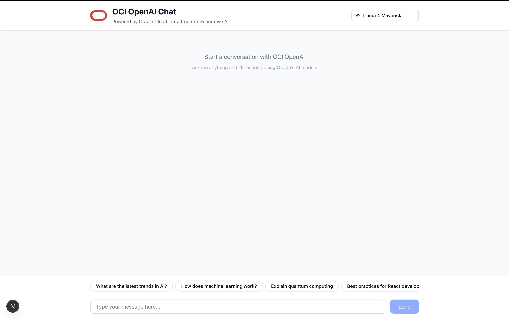

# Frontend — OCI OpenAI Chat UI

Next.js 16 (App Router) chat interface. Uses Vercel AI SDK v6; `/api/chat` calls the FastAPI OpenAI-compatible backend and runs MCP tools server-side.



## Setup

```bash
pnpm install
```

### Environment

Copy `env.example` to `.env.local` and set:

| Variable                                                 | Description                                                                                                                                                                    |
| -------------------------------------------------------- | ------------------------------------------------------------------------------------------------------------------------------------------------------------------------------ |
| `FASTAPI_BACKEND_URL`                                    | Backend base URL (default `http://localhost:3001`). Must be running for chat.                                                                                                  |
| `MCP_SERVERS_CONFIG`                                     | JSON array of MCP servers. Each entry: `url`, optional `authToken`, `timeoutMs`, `prefix`. Example: `[{"url":"http://localhost:3020/mcp","timeoutMs":15000,"prefix":"calc"}]`. |
| `MCP_ORACLE_RAG_URL`, `MCP_CALCULATOR_URL`               | Legacy: single URLs per server (used only when `MCP_SERVERS_CONFIG` is unset).                                                                                                 |
| `MCP_ORACLE_RAG_AUTH_TOKEN`, `MCP_CALCULATOR_AUTH_TOKEN` | Optional auth for legacy MCP URLs.                                                                                                                                             |

All MCP vars are server-only (not exposed to the client).

## Commands

| Command                     | Description                                                                        |
| --------------------------- | ---------------------------------------------------------------------------------- |
| `pnpm dev`                  | Dev server at http://localhost:3000                                                |
| `pnpm build`                | Production build                                                                   |
| `pnpm start`                | Run production server                                                              |
| `pnpm lint`                 | ESLint                                                                             |
| `node scripts/mcp_smoke.js` | MCP smoke test (connect + list tools; set MCP_ORACLE_RAG_URL / MCP_CALCULATOR_URL) |
| `pnpm test:e2e`             | Playwright E2E (starts dev on 4000 + mock backend/MCP)                             |

## Testing

- **MCP smoke:** `node scripts/mcp_smoke.js` — Connects to configured MCP URLs and lists tools. Requires at least one of `MCP_ORACLE_RAG_URL` or `MCP_CALCULATOR_URL` in env (e.g. `.env.local`).
- **E2E:** `pnpm test:e2e` — Runs Playwright against the app. Starts the Next dev server on port 4000 and mock OpenAI + MCP servers (calculator, RAG). One test sends "what is 1+2" and asserts tool call and answer. First run: `pnpm playwright:install` to install browsers.

## Main paths

- `src/app/page.tsx` — Chat page
- `src/app/api/chat/route.ts` — Chat API (streamText → FastAPI, MCP tools)
- `src/lib/mcp/*` — MCP client and tool execution
