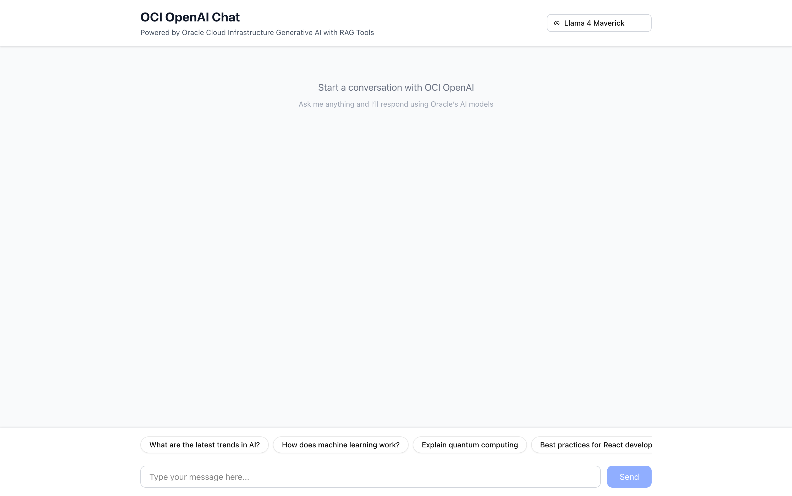
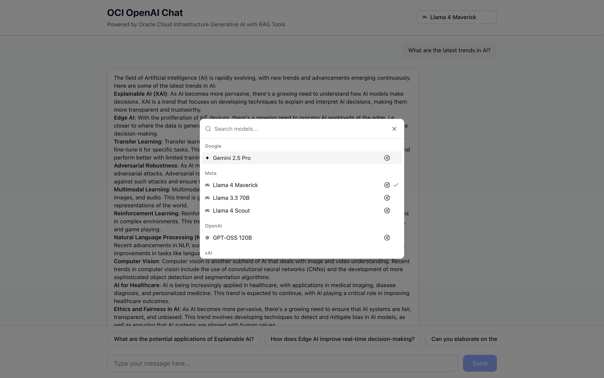
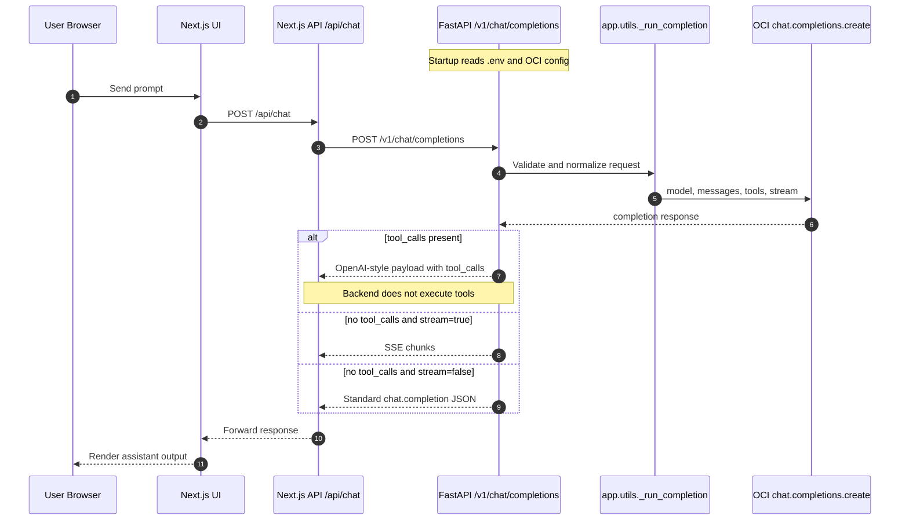

<div align="center">
  

# OCI OpenAI Chat Application

OpenAI-compatible chat experience on Oracle Cloud Infrastructure: a Next.js UI + FastAPI backend that exposes `/v1/chat/completions`, so you can use familiar OpenAI patterns, Vercel AI SDK, and client-side/server-side tool workflows.
</div>

> [!IMPORTANT]
> This project targets local development and integration workflows. Treat it as a reference implementation, not a production-ready deployment template.

## What you get

- Next.js 16 chat UI (React 19, TypeScript, Tailwind, AI SDK v6)
- FastAPI backend that maps OpenAI-style chat requests to OCI Generative AI
- OpenAI-compatible endpoints (`/v1/chat/completions`, alias `/api/v1/chat/completions`)
- Tool-call forwarding support (`tool_calls` are returned; execution is handled outside backend)
- Docker Compose path for running frontend + backend together

## Screenshots





## Backend flow (Mermaid)



## Project layout

```text
frontend/                # Next.js app and /api/chat bridge
backend/                 # FastAPI app, routers, tests, scripts
docker-compose.yml       # Combined local stack (frontend + backend)
images/                  # README screenshots
```

## Prerequisites

- Node.js 18+
- pnpm
- Python 3.10+
- uv
- OCI account with Generative AI access and valid OCI config/key

## Quick start

### 1) Backend

```bash
cd backend
uv sync
cp env.example .env
# Set at least: OCI_COMPARTMENT_ID, MODEL_ID
# Provide OCI config as backend/oci-config (or set OCI_CONFIG_FILE)
./scripts/start_fastapi.sh
```

Backend runs at `http://localhost:3001`

### 2) Frontend

```bash
cd frontend
pnpm install
cp env.example .env.local
# Optional: FASTAPI_BACKEND_URL=http://localhost:3001
pnpm dev
```

Frontend runs at `http://localhost:3000`

Health check: `GET http://localhost:3001/health`

## Environment (minimal)

| Location | Key | Notes |
| --- | --- | --- |
| `backend/.env` | `OCI_COMPARTMENT_ID` | OCI compartment OCID |
| `backend/.env` | `MODEL_ID` | Model ID used for chat completions |
| `frontend/.env.local` | `FASTAPI_BACKEND_URL` | Defaults to `http://localhost:3001` |
| `.env` (repo root) | `OCI_KEY_FILE` | Docker-only host path for key mount |

OCI config defaults to `backend/oci-config`. Profile is controlled by `OCI_CONFIG_PROFILE`.

## Docker

From repository root:

```bash
docker compose up -d
```

- Backend: `http://localhost:3001`
- Frontend: `http://localhost:3040`

> [!NOTE]
> For Docker, set `key_file=/app/oci_api_key.pem` in `backend/oci-config`, and set `OCI_KEY_FILE` in root `.env` to your host key path so Compose can mount it.

## Endpoints and tool behavior

- Main chat endpoints:
  - `/v1/chat/completions`
  - `/api/v1/chat/completions` (alias)
- Additional route:
  - `/api/chat` (simpler backend payload shape)
- Tool execution contract:
  - Backend forwards `tool_calls` in OpenAI-compatible format
  - Tool execution is performed by clients or external tool services, not by the backend route itself

## Testing

- Backend: `cd backend && uv run pytest`
- Frontend E2E: `cd frontend && pnpm test:e2e`
- Backend smoke script: `backend/scripts/test_chat_curl.sh`
