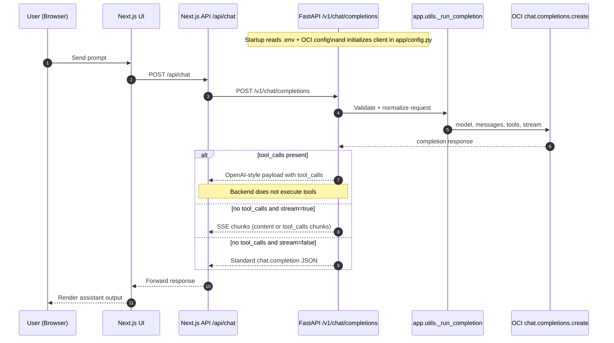

# OCI OpenAI Chat Application

Chat UI and API that let you use **Oracle Cloud Generative AI** with the same patterns as OpenAI: a single backend exposes an OpenAI-compatible API so you can plug in the Vercel AI SDK, existing tooling, and optional MCP tools (e.g. calculator, RAG) without changing clouds or locking into a single provider.

**Stack:** Next.js (frontend) + FastAPI (backend) with OCI GenAI. Frontend uses the Vercel AI SDK and calls the backend’s `/v1/chat/completions`

## Screenshots

### App UI


### Model Selection


## Stack

- **Frontend:** Next.js 16, React 19, TypeScript, Tailwind, AI SDK v6, pnpm
- **Backend:** FastAPI, Python 3.10+, uv, OCI GenAI (oci-openai client)

## Prerequisites

- Node.js 18+, pnpm
- Python 3.10+, [uv](https://docs.astral.sh/uv/)
- OCI account with Generative AI access; OCI config (e.g. `~/.oci/config`) and key file

## Quick start

**Backend**

```bash
cd backend
uv sync
cp env.example .env   # set OCI_COMPARTMENT_ID, MODEL_ID
# Copy OCI config to backend/oci-config (or set OCI_CONFIG_FILE)
./scripts/start_fastapi.sh
```

Runs at **http://localhost:3001**

**Frontend**

```bash
cd frontend
pnpm install
cp env.example .env.local   # optional: FASTAPI_BACKEND_URL
pnpm dev
```

Runs at **http://localhost:3000**

Open http://localhost:3000 and use the chat. Backend health: `GET http://localhost:3001/health`.

## Project layout

```
├── frontend/     Next.js app, pnpm, src/app/api/chat → FastAPI
├── backend/      FastAPI app (app/main.py, app/routers/), uv, pyproject.toml
└── docker-compose.yml
```

See **backend/Readme.md** for backend API, tests, and OCI setup. Use **pnpm** for frontend (see `.cursor/rules`).

## Backend flow (Mermaid)



Notes:

- Primary backend chat endpoints are `/v1/chat/completions` and `/api/v1/chat/completions`.
- `/api/chat` is also available for the simpler backend chat payload shape.
- Tool execution happens on the client side; backend only forwards `tool_calls`.

## Docker

From the repo root: `docker compose up -d`. Backend: http://localhost:3001, frontend: http://localhost:3040.

**How the backend reads OCI config:**

1. Copy your OCI config to **`backend/oci-config`** (e.g. from `~/.oci/config`). Docker Compose mounts it as **`/app/oci-config`**.
2. **Fix the key path for Docker:** in `backend/oci-config` set `key_file=/app/oci_api_key.pem` (the path inside the container). Do not use your host path (e.g. `/Users/.../oci_api_key.pem`) — it does not exist in the container.
3. In **`.env`** (project root, next to `docker-compose.yml`) set **`OCI_KEY_FILE`** to your key path on the host so Compose can mount it: e.g. `OCI_KEY_FILE=/Users/varuyada/Documents/keys/keys/Keys/oci_api_key.pem`. (Compose reads this file for volume substitution; do not put it only in `backend/.env`.)
4. Compose mounts that file into the container at `/app/oci_api_key.pem`, so the backend can read it.

## Env (minimal)

| Where               | Key                 | Example / note                                                               |
| ------------------- | ------------------- | ---------------------------------------------------------------------------- |
| backend/.env        | OCI_COMPARTMENT_ID  | OCID of your compartment                                                     |
| .env (project root) | OCI_KEY_FILE        | **Docker only:** host path to `oci_api_key.pem` (next to docker-compose.yml) |
| backend/.env        | MODEL_ID            | e.g. meta.llama-4-scout-17b-16e-instruct                                     |
| frontend            | FASTAPI_BACKEND_URL | default http://localhost:3001                                                |

OCI config: default `backend/oci-config` (copy from `~/.oci/config`); in that file set `key_file=/app/oci_api_key.pem` for Docker. Profile via `OCI_CONFIG_PROFILE`.

## Testing

- **Backend:** `cd backend && uv run pytest`
- **Frontend E2E:** `cd frontend && pnpm exec playwright test`
- **Smoke:** `backend/scripts/test_chat_curl.sh`

## License

MIT
