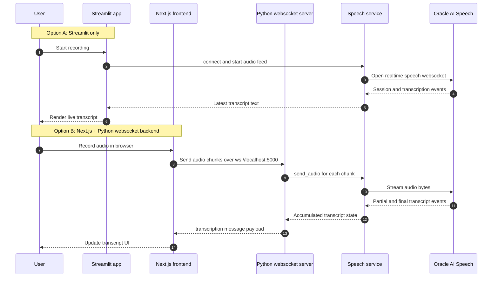

# Real-time Speech Transcription (Streamlit + Next.js)

Local-first speech transcription project with two UIs backed by Oracle Cloud Infrastructure AI Speech:

- **Streamlit app** (`app.py`) for fast local experimentation
- **Next.js app** (`frontend/`) for browser-based recording and live transcript UX

> [!IMPORTANT]
> This project is designed for **local development and learning**. It is not a production deployment template.

## What you get

- Real-time microphone transcription with **OCI AI Speech**
- Two frontend options (Streamlit and Next.js)
- Python websocket backend with health/readiness checks
- Live transcript updates, copy/download support, and basic troubleshooting paths

## Demo

See both app experiences before running locally:

- **Streamlit app demo**: [assets/Streamlit_live_transcript.mp4](assets/Streamlit_live_transcript.mp4)
- **Next.js app demo**: [assets/nextjs_live_transcript.mp4](assets/nextjs_live_transcript.mp4)

## Runtime flow (Mermaid)

This diagram shows the primary interaction paths: direct Streamlit recording and the Next.js client streaming audio to the Python websocket backend, which forwards audio to Oracle AI Speech and returns transcript updates.



## Project layout

```text
app.py                  # Streamlit UI entrypoint
server.py               # Python websocket backend (localhost:5000)
speech_service.py       # OCI realtime speech client + listener logic
audio_handler.py        # Local microphone capture
config.py               # Env loading and runtime config
message_schema.py       # Websocket message payload helpers
frontend/               # Next.js 16 UI and optional API proxy routes
```

## Prerequisites

- Python **3.12+**
- Node.js **20.9+**
- OCI account + credentials with access to AI Speech

## Environment

Create `.env` in the project root:

```env
OCI_USER=<your-user-ocid>
OCI_KEY_FILE=<path-to-api-key-file>
OCI_FINGERPRINT=<api-key-fingerprint>
OCI_TENANCY=<your-tenancy-ocid>
OCI_REGION=<your-region>
OCI_COMPARTMENT_ID=<your-compartment-id>
```

Optional frontend variables (`frontend/.env.local` or root `.env`):

```env
NEXT_PUBLIC_PYTHON_WS_URL=ws://127.0.0.1:5000
PYTHON_WS_URL=ws://127.0.0.1:5000
PYTHON_HTTP_BASE=http://127.0.0.1:5000
```

> [!NOTE]
> `NEXT_PUBLIC_PYTHON_WS_URL` is used by `frontend/pages/index.js` for direct browser websocket connections.
> `PYTHON_WS_URL` and `PYTHON_HTTP_BASE` are used by optional Next.js API proxy routes under `frontend/pages/api/`.

## Install

### Python dependencies

```bash
uv sync
```

### Frontend dependencies

```bash
cd frontend
npm install
```

## Quick start

### Option A: Streamlit only

```bash
uv run streamlit run app.py
```

Open: `http://localhost:8501`

### Option B: Next.js + Python websocket backend

Terminal 1:

```bash
uv run python server.py
```

Terminal 2:

```bash
cd frontend
npm run dev
```

Open: `http://localhost:3000`

Backend checks:

- `http://localhost:5000/health`
- `http://localhost:5000/ready`

## Docker (Streamlit app)

Build:

```bash
docker build -t oracle-ai-speech:dev .
```

Run:

```bash
docker run --rm -p 8501:8501 \
  --env-file .env \
  -e OCI_KEY_FILE=/home/appuser/.oci/oci_api_key.pem \
  -v "$HOME/.oci:/home/appuser/.oci:ro" \
  oracle-ai-speech:dev
```

Open: `http://localhost:8501`

> [!TIP]
> If Docker auth fails, verify that the key is mounted and `OCI_KEY_FILE` points to the **container path** (`/home/appuser/.oci/oci_api_key.pem`).

## Troubleshooting

- **No transcript appears**
  - Confirm backend is running: `uv run python server.py`
  - Confirm websocket URL: `ws://127.0.0.1:5000`
- **OCI auth/config errors**
  - Verify all required OCI env vars are set
  - Ensure `OCI_KEY_FILE` points to a readable private key file
- **Microphone issues**
  - Grant browser microphone permissions
  - Re-select input device in the UI
- **Backend readiness fails**
  - Check `http://localhost:5000/ready` for missing OCI config details
