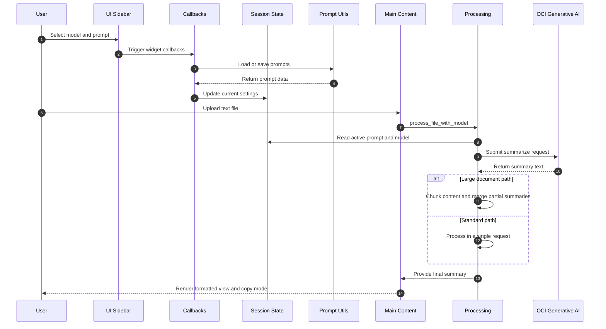

# Text Summarizer (Streamlit + OCI Generative AI)

Local-first Streamlit app for summarizing uploaded text files with Oracle Cloud Infrastructure (OCI) Generative AI.

> [!IMPORTANT]
> This project is intended for **local development and learning**. It is not a production deployment template.

## Highlights

- Upload `.txt` files and generate summaries with OCI Generative AI
- Save and reuse custom prompts
- Switch models and manage prompt templates from the sidebar
- Run locally with Python/uv or in Docker with mounted OCI credentials
- Optional E2E coverage with pytest + Playwright

## Application flow (Mermaid)

The diagram below focuses on runtime interactions between the user, Streamlit UI modules, prompt persistence, processing logic, and OCI Generative AI.



Code mapping:

- `src/app.py` orchestrates app setup and top-level flow.
- `src/ui/sidebar.py` and `src/ui/main_content.py` render core UI sections.
- `src/utils/callbacks.py` and `src/utils/prompts.py` handle prompt UX and persistence.
- `src/utils/processing.py` and `src/utils/oci_client.py` handle summarization and OCI calls.

## Project layout

```text
src/
├── app.py
├── config/        # constants + session state
├── ui/            # sidebar + main content renderers
├── components/    # reusable display components
└── utils/         # callbacks, prompts, OCI client, processing, styles

docs/
├── DOCKER-SETUP.md
└── testing-e2e.md

scripts/
└── test-oci-config.py
```

## Prerequisites

- Python **3.11+**
- `uv` installed
- OCI account with access to Generative AI
- Valid OCI config/profile and private key

## Environment and configuration

Create local config from examples:

```bash
cp config/config.yaml.example config/config.yaml
cp config/oci-config.example config/oci-config
```

Edit `config/config.yaml`:

```yaml
compartment_id: "ocid1.compartment.oc1..yourcompartmentidhere"
config_profile: "DEFAULT"
```

For Docker-based local OCI files, place your key at:

```text
keys/oci-private-key.pem
```

> [!NOTE]
> In `config/oci-config`, `key_file` must point to the container-visible path:
> `/home/appuser/.oci/oci-private-key.pem`

## Install

```bash
uv venv
source .venv/bin/activate   # Windows: .venv\Scripts\activate
uv pip install -e .
```

If you prefer requirements-based install:

```bash
uv pip install -r requirements.txt
```

## Run

### Option A: Local Python

```bash
uv run streamlit run src/app.py
```

Open: `http://localhost:8501`

### Option B: Docker

Run setup helper (creates missing local config scaffolding):

```bash
./docker/docker-setup.sh
```

Start container:

```bash
docker-compose up --build
```

Open: `http://localhost:8501`

Useful Docker commands:

```bash
docker-compose up -d
docker-compose logs -f
docker-compose restart
docker-compose down
```

For full Docker variants and troubleshooting, see [docs/DOCKER-SETUP.md](docs/DOCKER-SETUP.md).

## Usage

1. Select or edit a prompt in the sidebar (`{}` is the text placeholder).
2. Upload a text file (up to configured upload limit).
3. Generate summary and switch between formatted/copy-friendly views.
4. Save, update, or delete prompts (up to app limits).

## Validation and testing

Quick OCI check:

```bash
python scripts/test-oci-config.py
```

E2E tests (opt-in, real OCI calls when enabled):

```bash
E2E_REAL_OCI=0 pytest -m e2e -q
E2E_REAL_OCI=1 pytest -m e2e -q
```

More details: [docs/testing-e2e.md](docs/testing-e2e.md).

## Troubleshooting

- **Config file invalid / key path issues**
  - Ensure `config/oci-config` uses `key_file=/home/appuser/.oci/oci-private-key.pem`
  - Ensure `keys/oci-private-key.pem` exists and is readable
- **OCI authentication failures**
  - Verify OCIDs/profile in config files
  - Validate permissions for selected compartment
- **Docker runtime issues**
  - Check logs: `docker-compose logs -f`
  - Rebuild after config changes: `docker-compose up --build`
